# Rules Engine Python API & Editor

## Quickstart

### Docker (Recommended)

Pull and run the latest Docker image:
```shell
# Pull the latest image from GitHub Container Registry
docker pull ghcr.io/dyoun/rules-engine:latest

# Run the container
docker run -d \
  --name rules-engine \
  -p 5000:5000 \
  -e LICENSE_KEY=your_license_key_here \
  ghcr.io/dyoun/rules-engine:latest

# Test the API
curl --location 'http://localhost:5000/rules/latest' \
--header 'Content-Type: application/json' \
--data '{
    "observations": {
        "risk_type": "attic",
        "attic_vent_screens": false
    },
    "property_id": 1
}'
```

### Local Development

Prerequisites:
- Python 3.10+
- pip

Python API service for evaluating fire risk mitigation rules against property observations:
```shell
pip install -r requirements.txt
python main.py
curl --location 'http://localhost:5000/rules/latest' \
--header 'Content-Type: application/json' \
--data '{
    "observations": {
        "risk_type": "attic",
        "attic_vent_screens": false
    },
    "property_id": 1
}'
```

### Rules Editor (Optional)

[Rules Editor startup](https://hub.docker.com/r/gorules/brms):
```shell
docker-compose up
# NOTE: obtain license key from https://portal.gorules.io/signin
# http://localhost:9080/
```

Additionally, `rules_playground.ipynb` is a notebook where the rules engine can be interacted with directly via code.

### API Configuration

The application can be configured using environment variables:

- `HOST`: Server host (default: `0.0.0.0`)
- `PORT`: Server port (default: `5000`)
- `DEBUG`: Enable debug mode (default: `False`)
- `API_VERSION`: API version (default: `v1`)

Example:
```bash
export HOST=127.0.0.1
export PORT=8080
export DEBUG=true
python main.py
```

## Architecture Overview

This application demonstrates clean architecture principles with clear separation of concerns across multiple layers.

### System Architecture Diagram

```mermaid
classDiagram
    %% Domain Layer - Models
    class RuleEvaluationRequest {
        +observations: Union[Dict, List[Dict]]
        +version: Optional[str]
        +request_id: Optional[str]
    }
    
    class RuleEvaluationResult {
        +result: Union[Dict, List[Dict]]
        +performance: str
        +timestamp: datetime
        +api_version: str
        +request_id: Optional[str]
        +__post_init__()
    }
    
    %% Domain Layer - Interfaces
    class IRulesService {
        <<interface>>
        +evaluate_fire_risk(request: RuleEvaluationRequest)* RuleEvaluationResult
    }
    
    class IRulesRepository {
        <<interface>>
        +get_fire_risk_rules()* str
    }
    
    %% Application Layer - Services
    class RulesService {
        -engine: ZenEngine
        -rules_base_path: str
        +__init__(rules_base_path: str)
        +get_available_versions() List[str]
        +get_latest_version() str
        +load_rules_by_version(version: str) str
        +evaluate_fire_risk(request: RuleEvaluationRequest) RuleEvaluationResult
    }
    
    class FireMitigationService {
        -rules_api_base_url: str
        +__init__(rules_api_base_url: str)
        +submit_property_observations(property_id, observations, version) Dict
        +create_sample_observations() List[Dict]
        +process_property_risk_assessment(property_id, ...) Dict
    }
    
    %% Presentation Layer - Controllers
    class RulesController {
        +get_available_versions() Response
        +evaluate_rules_latest() Response
        +evaluate_rules_versioned(version: str) Response
    }
    
    %% Infrastructure Layer - Container
    class Container {
        +wiring_config: WiringConfiguration
        +rules_service: Factory
        +greeting_service: Factory
        +greeting_repository: Singleton
    }
    
    %% Relationships
    RulesService ..|> IRulesService : implements
    RulesController --> IRulesService : depends on
    RulesController --> RuleEvaluationRequest : uses
    RulesController --> RuleEvaluationResult : uses
    RulesService --> RuleEvaluationRequest : uses
    RulesService --> RuleEvaluationResult : creates
    Container --> RulesService : provides
    Container --> IRulesService : binds
    FireMitigationService --> RulesController : calls API
    
    %% Layer grouping
    classDef domainModel fill:#e1f5fe
    classDef domainInterface fill:#f3e5f5
    classDef applicationService fill:#e8f5e8
    classDef presentationLayer fill:#fff3e0
    classDef infrastructureLayer fill:#fce4ec
    
    class RuleEvaluationRequest domainModel
    class RuleEvaluationResult domainModel
    class IRulesService domainInterface
    class IRulesRepository domainInterface
    class RulesService applicationService
    class FireMitigationService applicationService
    class RulesController presentationLayer
    class Container infrastructureLayer
```



### SOLID Principles Applied

- **Single Responsibility Principle (SRP)**: Each class has one reason to change
  - `RuleEvaluation` model only handles rule evaluation data
  - `RulesService` only handles business logic
  - Repository classes only handle data access

- **Open/Closed Principle (OCP)**: Open for extension, closed for modification
  - New repository implementations can be added without changing existing code
  - New rule types can be added by extending the service

- **Liskov Substitution Principle (LSP)**: Objects should be replaceable with instances of their subtypes
  - Any `IRulesRepository` implementation can be substituted

- **Interface Segregation Principle (ISP)**: Many client-specific interfaces are better than one general-purpose interface
  - `IRulesRepository` and `IRulesService` are focused, single-purpose interfaces

- **Dependency Inversion Principle (DIP)**: Depend on abstractions, not concretions
  - Services depend on repository interfaces, not concrete implementations
  - Controllers depend on service interfaces, not concrete services

### Enterprise Design Patterns

- **Repository Pattern**: Abstracts data access logic (`IRulesRepository`)
- **Service Layer Pattern**: Encapsulates business logic (`RulesService`)
- **Dependency Injection**: Manages object dependencies via DI container
- **Layered Architecture**: Clear separation between domain, application, infrastructure, and presentation layers

## Project Structure

```
rules-eng-python/
├── src/
│   ├── domain/                 # Domain layer (entities, interfaces)
│   │   ├── models/
│   │   │   └── rule_evaluation.py  # Rules evaluation entities
│   │   └── interfaces/
│   │       ├── rules_repository.py     # Rules repository contract
│   │       └── rules_service.py        # Rules service contract
│   ├── application/            # Application layer (business logic)
│   │   └── services/
│   │       ├── rules_service.py        # Rules evaluation logic
│   │       └── fire_mitigation_service.py  # Fire mitigation logic
│   ├── infrastructure/         # Infrastructure layer (data access)
│   │   └── repositories/
│   ├── presentation/           # Presentation layer (API controllers)
│   │   ├── controllers/
│   │   │   └── rules_controller.py     # Rules evaluation REST API endpoints
│   │   └── app.py             # Flask application factory
│   └── config/                # Configuration
│       ├── container.py       # Dependency injection container
│       └── settings.py        # Application settings
├── tests/                     # Test directory
├── observations.json         # Sample input data
├── run-rules.ipynb          # Jupyter notebook example
├── requirements.txt         # Python dependencies
├── main.py                 # Application entry point
└── README.md               # This file
```

## API Endpoints

### Health Check
- **GET** `/health`
  - Returns service health status
  - Response: `{"status": "healthy", "service": "rules-engine-api"}`

### Rules Engine
- **POST** `/rules/latest`
  - Evaluates rules against provided observations
  - Request body: 
    ```json
    {
        "observations": [
            {
                "risk_type": "windows",
                "window_type": "single",
                "vegetation_type": "tree",
                "distance": 80
            },
            {
                "risk_type": "attic",
                "attic_vent_screens": false
            },
            {
                "risk_type": "roof",
                "roof_type": "c",
                "wild_fire_risk": "a"
            }
        ],
        "property_id": 1
    }    
    ```
  - Response:
    ```json
    {
        "api_version": "3",
        "performance": "116.6µs",
        "property_id": 1,
        "result": [
            {
                "distance": 80,
                "mitigations": {
                    "bridge": [
                        "Apply a Film to windows which decreases minimum safe distance by 20%",
                        "Apply flame retardants to shrubs that decrease minimum safe distance by 25%",
                        "Prune trees to a safe height decreases safe distance by 50%"
                    ],
                    "full": [
                        "Remove Vegetation",
                        "Replace window with Tempered Glass"
                    ]
                },
                "risk_type": "windows",
                "safe_distance": 30,
                "safe_distance_base": 30,
                "safe_distance_calc": 90,
                "safe_distance_diff": 10,
                "vegetation_type": "tree",
                "window_type": "single"
            },
            {
                "attic_vent_screens": false,
                "mitigations": "Add Vents",
                "risk_type": "attic"
            },
            {
                "mitigations": "No Mitigation",
                "risk_type": "roof",
                "roof_type": "c",
                "wild_fire_risk": "a"
            }
        ],
        "timestamp": "2025-08-26T02:16:45.879520"
    }
    ```
- **POST** `/rules/versions/:id`
    
## Testing


The project includes comprehensive unit tests for the zen rules engine:

- **test_attic_rule.py**: Tests attic ventilation screen evaluations
- **test_roof_rule.py**: Tests roof type and wildfire risk evaluations  
- **test_window_rule.py**: Tests window safety distance calculations

Run tests locally:
```bash
pytest tests/ -v
```

## Dependencies

- **Flask 3.0.0**: Web framework
- **dependency-injector 4.41.0**: Dependency injection container
- **Werkzeug 3.0.1**: WSGI utilities (Flask dependency)
- **zen-engine 0.49.1**: Rules evaluation engine
- **pytest 8.4.1**: Testing framework
- **requests 2.31.0**: HTTP library

## Design Benefits

1. **Maintainability**: Clear separation of concerns makes code easier to modify
2. **Testability**: Dependencies can be easily mocked for unit testing
3. **Extensibility**: New features can be added without modifying existing code
4. **Scalability**: Architecture supports growth and complexity
5. **Flexibility**: Components can be swapped out (e.g., rule repository instead of in-memory)

## Future Enhancements

- Authentication and authorization
- Input validation and error handling middleware
- Logging and monitoring
- Unit and integration tests
- Docker containerization
- CI/CD pipeline

## Sources
* [GoRules BRMS - Rules UI Interface](https://hub.docker.com/r/gorules/brms)
* [GoRules Pricing](https://gorules.io/pricing)
